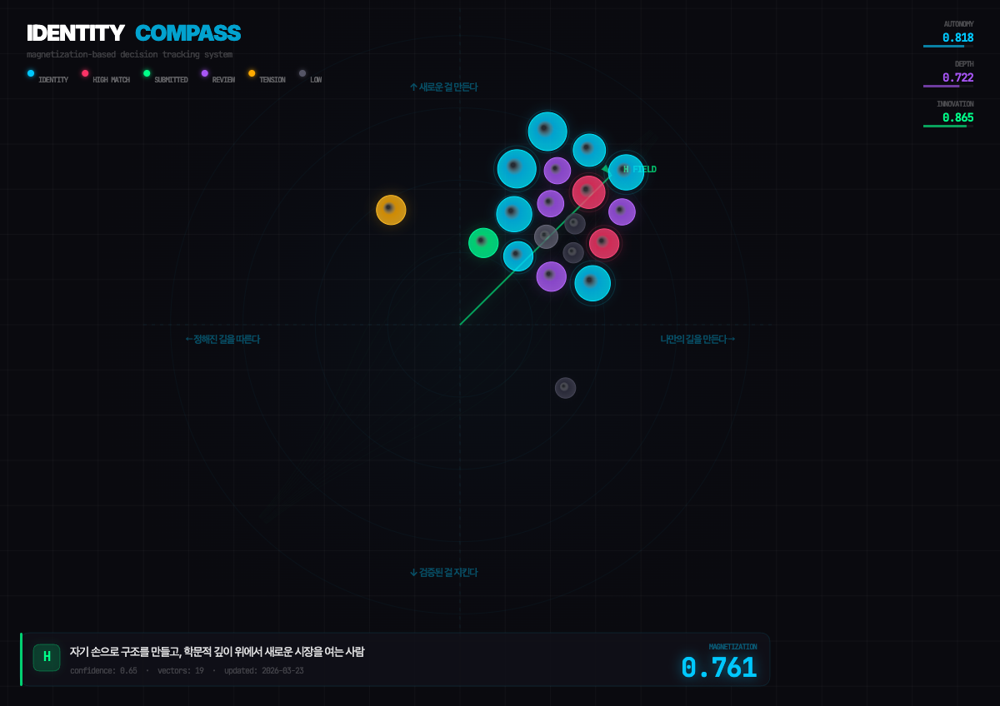
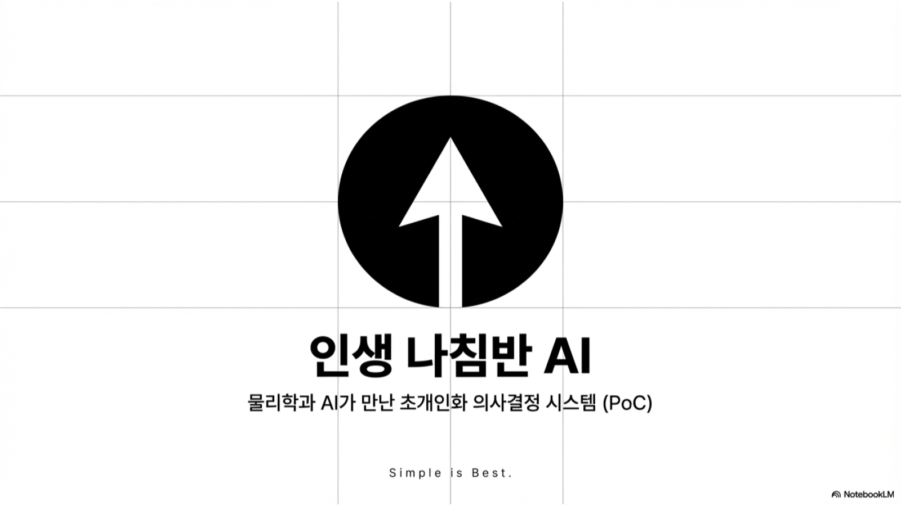
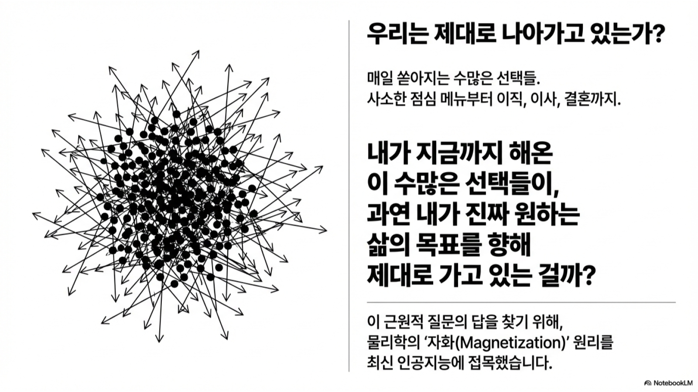
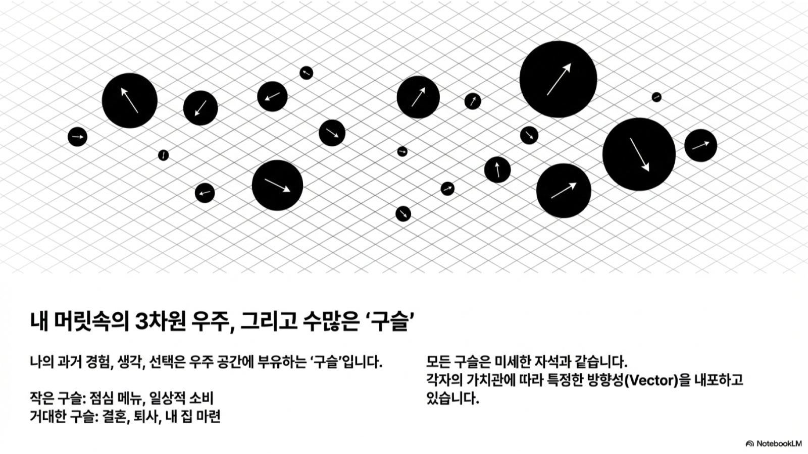
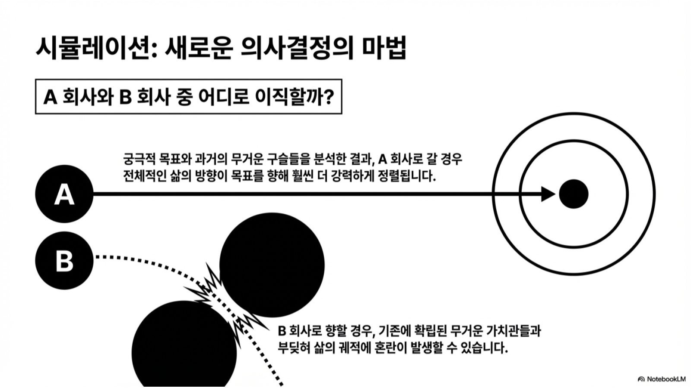
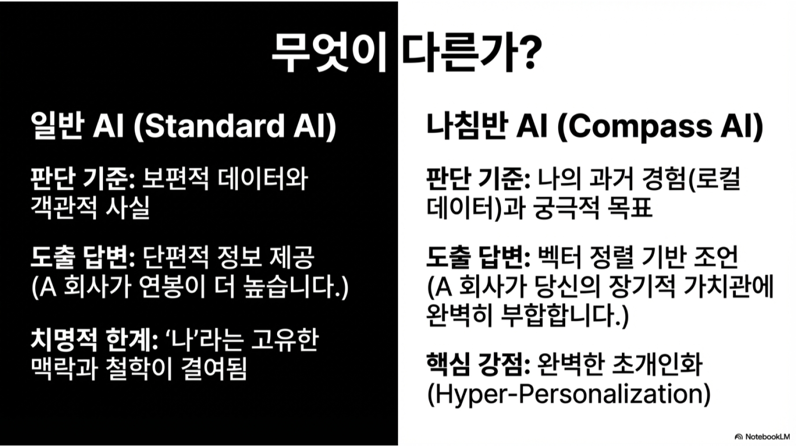

<div align="center">

# 🧭 Identity Compass

### You already know what you want. You just can't see it yet.

[](LICENSE)
[](https://openclaw.ai)
[](https://python.org)

[English](#the-problem) · [한국어](README_KO.md) · [中文](README_ZH.md)

<br>

<br><br>


</div>

---

## The Problem

You've taken personality tests. Set goals on January 1st. Made pros-and-cons lists. And still — when it actually matters — you freeze.

**"Should I take this job?"**
**"Is this relationship right for me?"**
**"Am I heading in the right direction?"**

The real answer is already inside you. It's scattered across hundreds of small decisions you've already made — what excited you, what drained you, what you kept coming back to, what you quietly avoided.

**No one is tracking those patterns. Until now.**

## What Identity Compass Does

It watches your conversations. Not to judge — to **listen**.

Every time you express a preference, reject something, light up about an idea, or hesitate at a crossroads — the system captures it as a tiny compass needle. Over time, those needles align. A direction emerges.

Then, when you face a real decision, instead of guessing, you can ask:

> *"Does this choice point the same way I've been pointing all along?"*

### Real Examples

| You say... | The system sees... |
|-----------|-------------------|
| "I'd rather build my own thing than follow someone else's playbook" | Strong autonomy signal |
| "That job pays well but I'd just be executing" | Anti-pattern: execution without ownership |
| "I lost track of time working on that side project" | Flow state → core value indicator |
| "Honestly, I'm jealous of how she lives" | Aspiration signal → direction candidate |

You don't fill out forms. You don't answer questionnaires. You just... talk. The compass does the rest.

<div align="center">

<br><em>Are your countless choices actually leading you toward your true goals?</em>
<br><br>

<br><em>Every decision is a marble with a direction vector — small ones for coffee, big ones for career moves.</em>
</div>

## What You Get

### 🎯 Your Direction (H Vector)
A one-liner that captures who you are — not who you think you should be.

> *"Chooses autonomy over structure, builds depth through research, drives innovation over comfort."*

This isn't a horoscope. It's computed from your actual decisions.

### 📊 Your Alignment Score (M)
A single number (0 to 1) showing how aligned your recent choices are with your true direction.

- **0.8+** → You're locked in. Decisions are coherent.
- **0.5-0.7** → Mostly on track, some noise.
- **Below 0.3** → You're pulling in multiple directions. Time to reflect.

### ⚖️ Decision Simulation
Facing a fork in the road? Each option gets simulated:

```
Option A: Take the startup offer
  → Alignment shifts from 0.68 → 0.72 ✅

Option B: Stay at current job  
  → Alignment shifts from 0.68 → 0.61 ⚠️
```

Not "Option A is better." Instead: **"Option A is more *you*."**

<div align="center">

<br><em>Simulate decisions before you make them.</em>
</div>

### 🗺️ Your Decision Map
An interactive visualization where every past decision is a marble — sized by importance, colored by alignment. Watch your patterns emerge in real time.

## Who This Is For

- **Career changers** — "I know I need to leave, but where do I go?"
- **Founders** — "Am I building what I actually care about?"
- **Anyone at a crossroads** — "This feels right but I can't explain why"
- **People tired of generic advice** — This is built from *your* data, not a template

## What This Is NOT

- ❌ Not a personality test (no self-reporting)
- ❌ Not a goal-setting app (goals change; direction persists)
- ❌ Not an AI that decides for you (data, not decisions)
- ❌ Not cloud-based (everything stays on your machine)

<div align="center">

<br><em>Generic AI gives you facts. Compass AI gives you alignment.</em>
</div>

## Quick Start

```bash
git clone https://github.com/ico1036/identity-compass.git
cp -r identity-compass/ ~/.openclaw/workspace/skills/identity-compass/
mkdir -p ~/.openclaw/workspace/obsidian-vault/compass/{vectors,clusters,signals,prior}
```

That's it. Start talking to your [OpenClaw](https://openclaw.ai) agent. The compass activates automatically.

### See Your Map

```bash
cd identity-compass/scripts && python3 -m http.server 8742
# Open http://localhost:8742/visualize_2d.html
```

---

<details>
<summary><b>🔬 How It Works (Technical Details)</b></summary>

### The Physics Model

Identity Compass borrows from **statistical mechanics**. Each decision is a magnetic spin with direction and intensity. The system computes:

- **H (Magnetic Field)** = your core direction, extracted via dialectical dialogue
- **M (Magnetization)** = net alignment of all spin vectors with H
- **Decay** = older decisions fade at `0.95^(days/30)` — who you are *now* matters more

### Three Axes

| Axis | (+) | (−) |
|------|-----|-----|
| X | Autonomy | Structure |
| Y | Depth | Breadth |
| Z | Innovation | Stability |

### Phase 1: Dialectical Extraction

Instead of asking "what do you want?", the system uses four dialogue patterns:
1. **Dilemma** — forced trade-offs reveal hidden priorities
2. **Time-shift** — "what would past-you think of present-you?"
3. **Contradiction** — "you said X but did Y..."
4. **Completion** — "you already know, don't you?"

### Phase 2: Bayesian Vector Collection

Each decision is extracted with:
- 3D direction vector
- Weight (1-10) based on: financial impact, time commitment, irreversibility, emotional intensity, mention frequency
- Beta(α,β) posterior updates per axis

### Phase 3: Virtual Simulation

New choices become virtual marbles → ΔM computed for each option → alignment comparison.

### Architecture

```
identity-compass/
├── SKILL.md                          # Agent protocol
├── references/
│   ├── dialectical-protocol.md       # 7-dimension dialogue system
│   └── bayesian-update.md            # Posterior math
├── scripts/
│   ├── export_vectors.py             # Vault → vectors.json
│   ├── calculate_magnetization.py    # H + M computation
│   └── visualize_2d.html             # 2D marble visualization
└── example-vault/                    # Obsidian template
```

### Data Flow

```
Conversation → Signal Detection → Vector Extraction → Obsidian Vault
    → export_vectors.py → vectors.json → calculate_magnetization.py
    → magnetization.json → visualize_2d.html
```

</details>

---

## Contributing

This is early. The model works, but there's so much to explore:

- [ ] Time-series: watch your direction evolve over months
- [ ] Team compass: what happens when a group computes shared H?
- [ ] Integration with Notion, Logseq, and other note systems
- [ ] More dialogue protocols for different cultures/languages

PRs and ideas welcome.

## License

[MIT](LICENSE)

## Author

**Jiwoong Kim** — [@ico1036](https://github.com/ico1036)

---

<div align="center">

*"The compass doesn't tell you where to go.*
*It shows you where you've been heading all along."*

</div>
